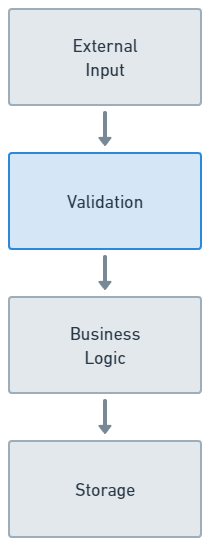

# Speck

A library for input validation and protocol documentation with a focus on being lightweight and tightly focused, designed for embedded systems and web applications.

## Installation

The package can be installed by adding `speck` to your list of dependencies
in `mix.exs`:

```elixir
def deps do
  [
    {:speck, "~> 0.1.0"}
  ]
end
```

Add the Speck compiler to your `mix.exs` project config:

```elixir
compilers: Mix.compilers ++ [:speck]
```

## Philosophy

Speck is designed to be the validation layer for an application. The key here is "layer": Your application should employ a [layered architecture](https://www.oreilly.com/library/view/software-architecture-patterns/9781491971437/ch01.html) to use Speck effectively. Speck should sit between the external input and business logic layers. In an MVC framework this would be between the controller and model. The layers should have hard boundaries, meaning function calls can only happen sideways or to the layer directly below. Input and return values should pass through a transformation when crossing layer boundaries, preventing a layer from leaking through its neighbors.



> _Phoenix / Ecto users:_ Although Speck schemas may feel familiar compared to Ecto schemas, it is important to understand that the Speck design pattern is completely different. Phoenix uses a leaky abstraction to pass input params into a changeset / schema, which is used all the way down to the database. With Speck, the schema should represent the shape of the input, NOT the shape of the database. Validation should happen in the controller or live view, with the attributes of a valid schema then being passed to the context layer (business logic). The context layer should be responsible for constructing the application's internal representation of the data, which could be a struct or Ecto schema.

The structs used for validation should be different from the ones passed around internally. In an embedded system the structs would represent messages from another system. In a web application the structs would represent form data from an HTML page.

A good way to determine which layer a struct is in is to determine if it is a noun (`Device`) or a verb (`AddDevice`). Verbs are effects on your system, which are messages with payloads to validate. Nouns are a representation of an object internal to your system, and are below the validation layer.

```elixir
# Validation layer

%MQTT.AddDevice{}
%MQTT.RemoveDevice{}

# Model layer

%Device{}
```

The schemas can also be versioned.

```elixir
# mqtt/v1/add_device.ex
%MQTT.V1.AddDevice{}

# mqtt/add_device.v1.ex
%MQTT.AddDevice.V1{}
```

Transform data when crossing layers. In the input handler, perform the message validation. If the payload is invalid, it can fail fast and return the error(s) upstream. If it succeeds, transform the message into internal data (struct) and pass it to the business logic layer.

```elixir
def input_received(params) do
  case Speck.validate(MQTT.AddDevice.V1, params) do
    {:ok, message} ->
      device = Device.create!(message.id, message.rs485_address)
      {:ok, device}

    {:error, errors} ->
      {:error, errors}
  end
end
```

### Schemas as documentation

Speck supports the "documentation as code" philosophy and is designed to document the input payloads with its description language. The same file that explains the input to an engineer is the same one executed to validate the input. This prevents documentation for people from going out of date with the source code. The schemas can also be used for collaboration when designing or explaining a protocol. They are designed to be reasonably comprehensible by non-Elixir engineers.

Schemas can't be nested. They are designed to be the complete representation of a message. If you find yourself trying to nest schemas, it is likely a code smell for something you should be doing in the business logic or storage layers.

```elixir
struct MQTT.AddDevice.V1

name "add_device"

attribute :uuid,           :string,  format: ~r/\A\d{5}\-\d{5}\-\d{5}\-\d{5}\-\d{5}\z/
attribute :type,           :atom,    values: [:temperature, :humidity, :air_quality]
attribute :rs485_address,  :integer, min: 1, max: 255
attribute :serial_number,  :string,  length: 16
attribute :wifi_ssid,      :string,  optional: true
attribute :low_power_mode, :boolean, optional: true
attribute :dns_servers,    [:string]

attribute :metadata do
  attribute :location,   :string
  attribute :department, :string

  attribute :ports do
    attribute :rs485, :integer
  end
end

attribute [:sensors], optional: true do
  attribute :type,    :atom
  attribute :address, :integer
end
```
